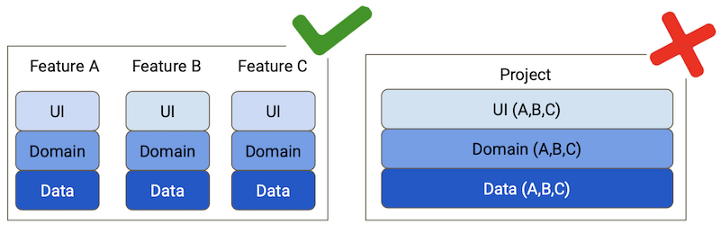
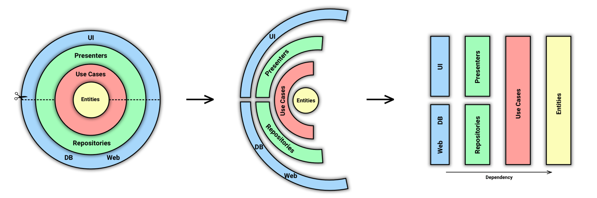

<h1 align="center">Bogadex

</h1>

  
  
  
  
  
  

Bogadex is a minimalist yet functional Android application showcasing modern development standards with a focus on clean architecture, code quality, and progressive enhancements. It uses the BoardGameGeek API to explore, filter, and present board game collections elegantly.

 

## ✨ Overview

Bogadex is a side project crafted with passion. It aims to demonstrate modern Android practices using Jetpack Compose, Material 3, and a scalable architecture. The app is a playground for exploring new concepts while keeping things simple, robust, and open.

## 🔧 Key Features

- Browse your [BoardGameGeek](https://boardgamegeek.com/) collection
- Sort and filter your games with Compose UI
- Background data refresh & sync with Work Manager
- Dark mode with Material 3 dynamic theming
- Offline access via Room & caching
- Android & Community best practices oriented
- Full MVVM with a modular, scalable structure
- Built-in CI/CD with quality gates (lint, test, sonar)

## 🧬 Stack & Practices

| Area               | Tools & Libraries                                                 |
|--------------------|-------------------------------------------------------------------|
| **Language**        | Kotlin (100%)                                                     |
| **UI**              | Jetpack Compose, Material 3                                       |
| **Architecture**    | MVVM → MVI, Repository, UseCases                                  |
| **Dependency DI**   | Koin                                                              |
| **Data Layer**      | Room, Retrofit (soon Ktor), DataStore                             |
| **Asynchronous**    | Kotlin Flow, Coroutines, Work Manager                             |
| **Image Loading**   | Coil                                                              |
| **Build Tools**     | Gradle (optimized), GitHub Actions                                |
| **Quality**         | KtLint, Spotless, Unit & Instrumentation Tests, Kover, SonarCloud |

## 📦 Code Standards

Bogadex adheres to:

- **[Conventional Commits](https://www.conventionalcommits.org/en/v1.0.0/)** for clarity and semantic versioning.
- **[SemVer](https://semver.org/)** for meaningful releases.
- **CI-enforced formatting** via Spotless/KtLint.
- Clear **module boundaries** by feature and responsibility.

## 🧪 Testing & Quality

The project embraces automated testing and code quality:

- Unit & instrumentation tests
- Linting on commit
- SonarCloud coverage & code smell detection
- GitHub Actions for validation pipelines
- Code coverage with [Kover](https://kotlin.github.io/kotlinx-kover/)

## 🚧 Roadmap & Ideas

This project evolves gradually in spare time. Here are upcoming explorations:

- 🧩 Widgets (Glance + Compose) — [guide](https://joebirch.co/android/exploring-jetpack-compose-for-widgets-with-glance/)
- 🌐 Retrofit → Ktor — [migration article](https://medium.com/@santimattius/from-retrofit-to-ktorfit-on-the-way-to-kotlin-multiplatform-eebfa81f87ed)
- 🖌️️ UI/UX improvements — [cookbook](https://github.com/Gurupreet/ComposeCookBook)
- 🧭 Navigation - Migrate to [jetpack navigation 3](https://android-developers.googleblog.com/2025/05/announcing-jetpack-navigation-3-for-compose.html)
- 📈 Performance improvements — [video](https://www.youtube.com/watch?v=d8SXNwy6VDs&list=WL&index=5)
- 🔁 Rewrite test structure & introduce test automation

## 🧭 Architecture

Bogadex follows a Clean Architecture and modular approach:

- **MVVM + MVI** for UI logic
- **UseCases** as business logic orchestration
- **Modular structure** per feature
- **Repository pattern** for separation of concerns

## 🎲 BoardGameGeek API

Bogadex uses the [BoardGameGeek XML API](https://boardgamegeek.com/wiki/page/BGG_XML_API2) to query data from the largest board game database.

The API provides rich details (titles, thumbnails, stats, etc.) through REST-like XML endpoints.

## 🤝 Credits & Thanks

Bogadex is inspired by many developers, creators, and open-source projects that share knowledge generously:

### 👨‍💻 Developers

- **[Jaewoong Eum (skydoves)](https://github.com/skydoves)**
  Creator of [Pokedex](https://github.com/skydoves/Pokedex) and many other modern Android examples.
  Inspiring clean architecture and Compose integrations.

- **[Philipp Lackner](https://github.com/PhilippLackner)**
  Developer advocate and educator — [YouTube Channel](https://www.youtube.com/@PhilippLackner)
  Clear and insightful videos on advanced Android patterns, KMM, DI, Compose, and testing.

### 📦 Projects

- [Rocket.Chat (open source messaging platform)](https://github.com/RocketChat/Rocket.Chat)
  Reference for scalable architecture and community-led development.

- [Pokedex by skydoves](https://github.com/skydoves/Pokedex)
  A well-designed Android app using Jetpack Compose, Hilt, and modern UI patterns.

## ☕ Support

Bogadex is a personal project made with ❤️ on personal time. If you find it useful, feel free to [support via Ko-Fi](https://ko-fi.com/S6S4IFFOB). It helps with tools, hosting, and motivation!

## 📜 License

This project is licensed under the terms of the [BSD 3-Clause](LICENSE).
